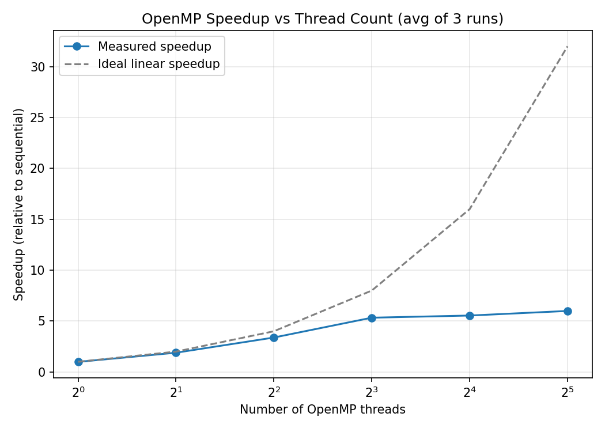
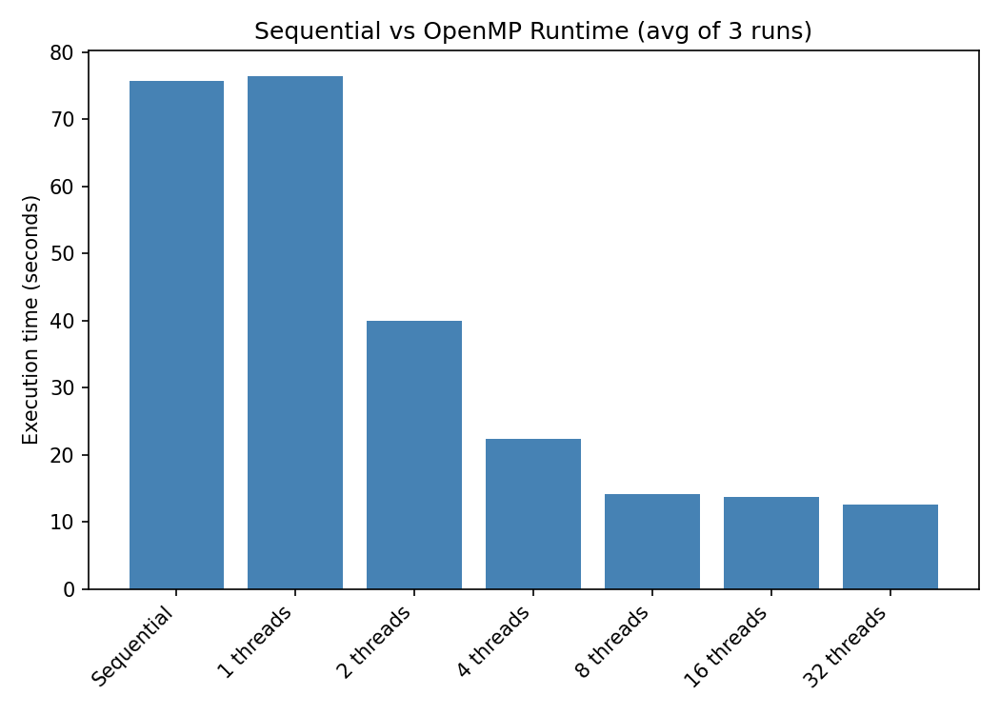
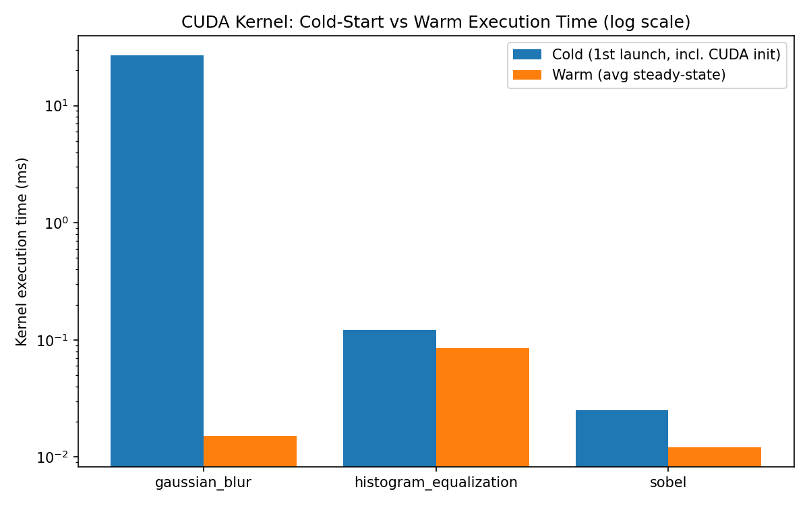
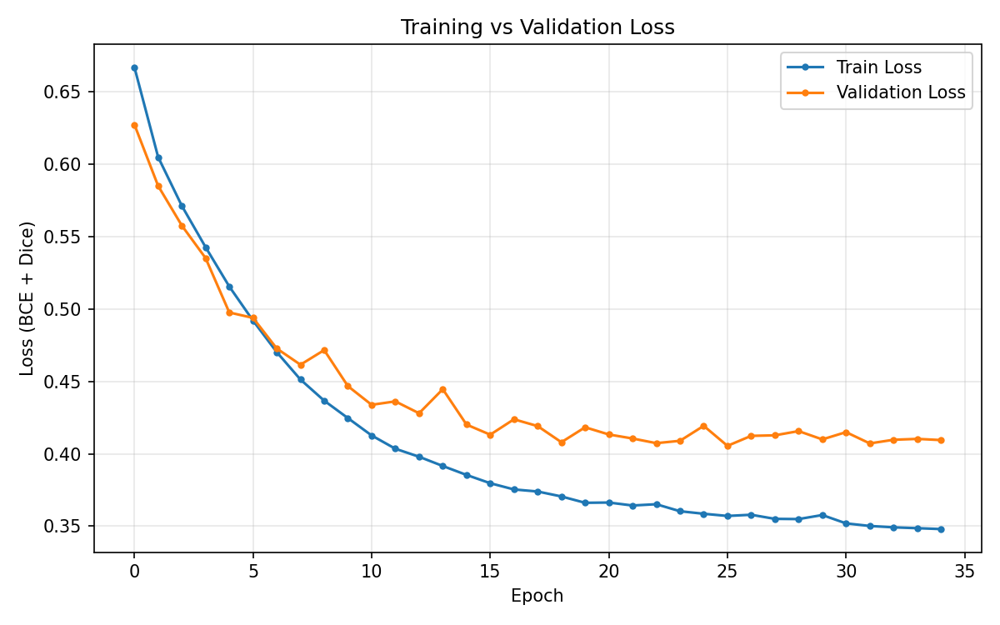
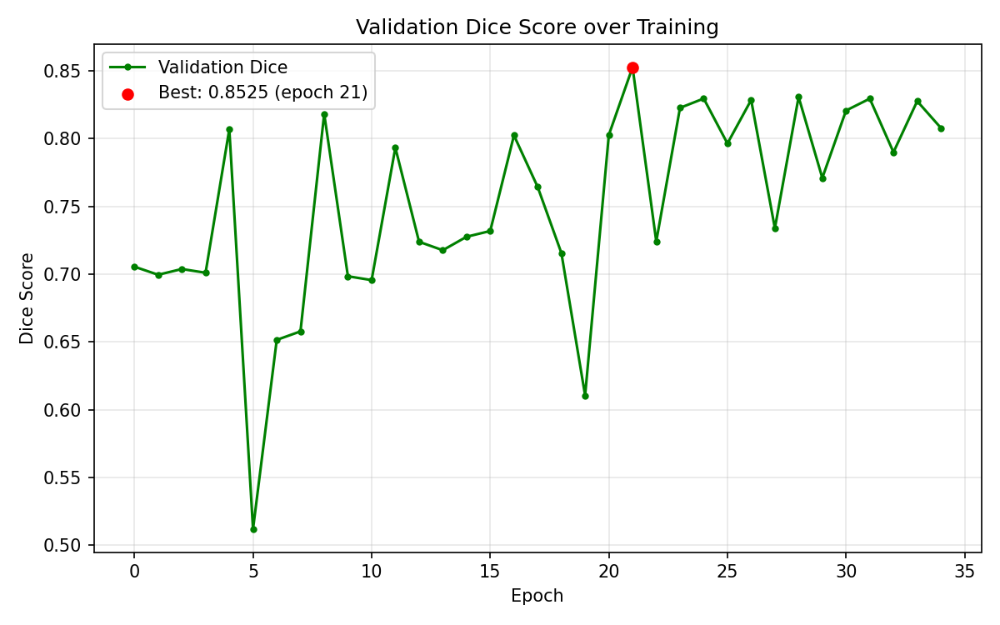
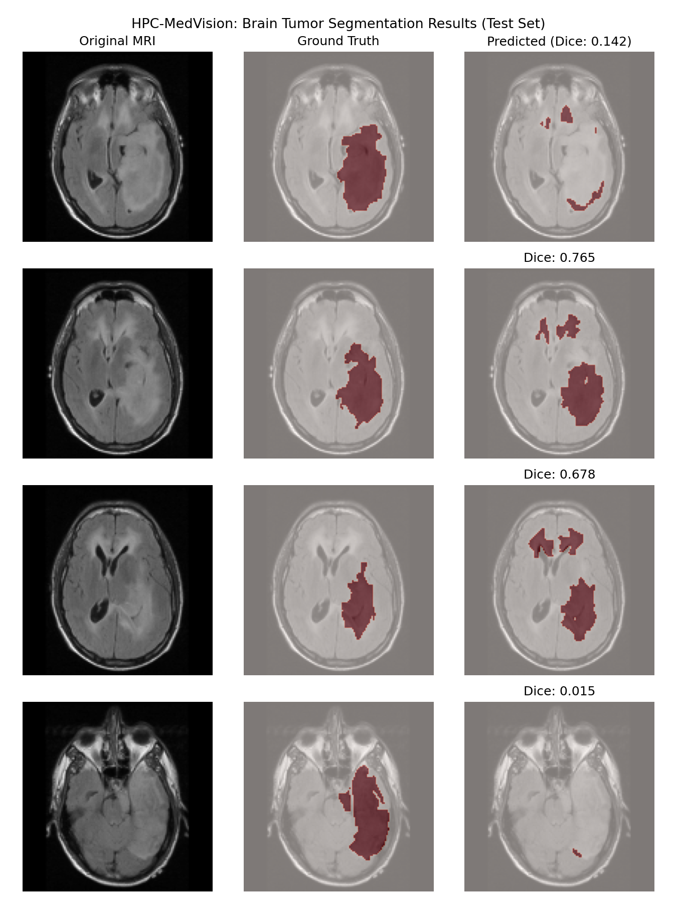
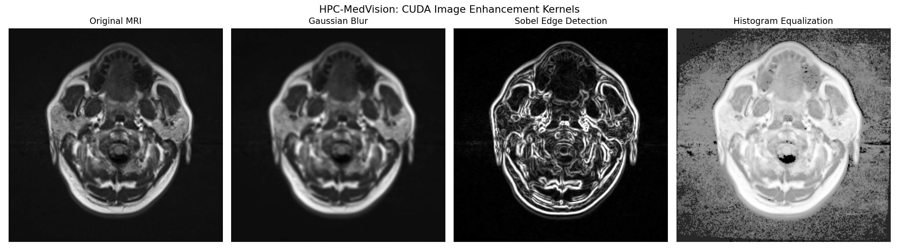

# HPC-MedVision

> GPU-Accelerated Brain Tumor Segmentation using OpenMP, CUDA, and PyTorch on the Ramanujan Universe Supercomputer.


---

## Overview

HPC-MedVision is a High Performance Computing (HPC) project developed during my **High Performance Computing Internship at Jaypee Institute of Information Technology (JIIT)** on the **Ramanujan Universe Supercomputer**.

The project accelerates brain tumor segmentation from MRI images by combining:

- **OpenMP** for multi-core CPU preprocessing
- **CUDA** for GPU-accelerated image enhancement
- **PyTorch U-Net** for semantic segmentation
- Performance benchmarking across Sequential CPU, OpenMP, and CUDA implementations

---

## Features

- Parallel MRI preprocessing using OpenMP
- CUDA implementation of:
  - Gaussian Blur
  - Sobel Edge Detection
  - Histogram Equalization
- Brain tumor segmentation using a lightweight U-Net
- CPU vs OpenMP vs CUDA benchmarking
- Performance visualization and analysis
- HPC job execution using PBS Professional

---

## Tech Stack

### Languages
- C++
- Python

### HPC Technologies
- OpenMP
- CUDA
- Linux
- PBS Professional Scheduler

### Libraries
- PyTorch
- OpenCV
- NumPy
- Pandas
- Matplotlib

---

## Dataset

The project uses the **LGG Brain MRI Segmentation Dataset**.

- **110 Patients**
- **3,929 MRI Slice–Mask Pairs**
- Patient-level Train / Validation / Test Split

> **Note:** The dataset is **not included** in this repository due to its large size (~1.4 GB). Please download it separately from Kaggle and place it inside:

```
data/raw/kaggle_3m/
```

---

## Project Structure

```
HPC-MedVision/
│
├── benchmark/          # Benchmarking & visualization scripts
├── cuda/               # CUDA kernels
├── data/               # Dataset utilities & split files
├── jobs/               # PBS job scripts
├── openmp/             # OpenMP preprocessing implementation
├── results/            # Benchmark graphs & evaluation outputs
└── unet/               # U-Net model, training & evaluation
```

---

## Performance Highlights

### OpenMP Benchmark

| Threads | Runtime (s) | Speedup |
|----------|------------:|---------:|
| Sequential | 75.68 | 1.00× |
| 2 | 40.00 | 1.89× |
| 4 | 22.36 | 3.38× |
| 8 | 14.19 | 5.33× |
| 16 | 13.65 | 5.55× |
| 32 | 12.62 | **6.00×** |

---

### CUDA Kernel Performance

| Kernel | Warm Runtime |
|---------|-------------:|
| Gaussian Blur | ~0.015 ms |
| Sobel Edge Detection | ~0.012 ms |
| Histogram Equalization | ~0.085 ms |

The benchmarking also isolates the CUDA cold-start overhead, showing that initialization cost is paid only once during the first kernel launch.

---

## U-Net Evaluation

| Metric | Value |
|---------|------:|
| Dice Score | **0.698** |
| IoU | **0.536** |
| Precision | **0.865** |
| Recall | **0.585** |
| Pixel Accuracy | **0.995** |

---

## Generated Results

The repository includes:

- OpenMP Speedup Graph
- Runtime Comparison Graph
- CUDA Warm-up Analysis
- Training Loss Curve
- Dice Score Curve
- MRI Segmentation Demo
- CUDA Image Processing Demo

---

## Running the Project

This project was developed and benchmarked on the **Ramanujan Universe Supercomputer**.

Required software:

- Linux
- GCC
- CUDA Toolkit
- OpenMP
- PyTorch
- OpenCV
- PBS Professional

Typical environment setup:

```bash
module load gcc/12.2.0
module load cuda12.2/toolkit/12.2.2
module load anaconda3/anaconda

conda activate hpcmedvision
```

---

---

# Results

## OpenMP Speedup

The OpenMP implementation achieved up to **6× preprocessing speedup** compared to the sequential implementation.



---

## Runtime Comparison

Comparison of sequential and OpenMP execution times across different thread counts.



---

## CUDA Warm-up Analysis

Comparison of CUDA cold-start latency and steady-state kernel execution time.



---

## Training Curves

Training and validation loss during U-Net training.



Validation Dice Score over training epochs.



---

## Brain Tumor Segmentation Results

Examples of predictions produced by the trained U-Net model on the test set.



---

## CUDA Image Preprocessing

Comparison of the original MRI image with Gaussian Blur, Sobel Edge Detection, and Histogram Equalization.



---

## Key Learnings

During this project I gained practical experience in:

- High Performance Computing
- Parallel Programming with OpenMP
- GPU Computing using CUDA
- Deep Learning with PyTorch
- Medical Image Processing
- Performance Benchmarking
- Linux and HPC Job Scheduling

---

## Future Improvements

- 3D U-Net / V-Net
- Multi-GPU Training
- Mixed Precision Inference
- TensorRT Optimization
- Transformer-based Medical Image Segmentation

---

## Author

**Ansh Kumar**

B.Tech Computer Science & Engineering  
Jaypee Institute of Information Technology

---

## Acknowledgements

- Jaypee Institute of Information Technology (JIIT)
- Ramanujan Universe Supercomputer
- LGG Brain MRI Segmentation Dataset
- PyTorch
- OpenCV